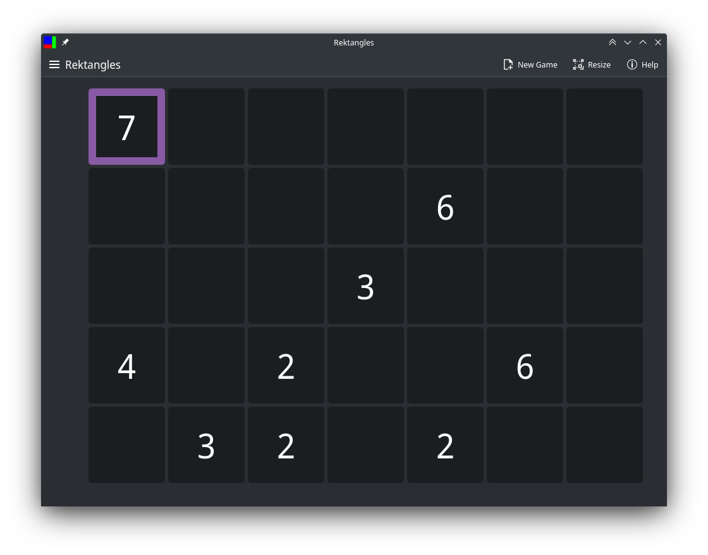
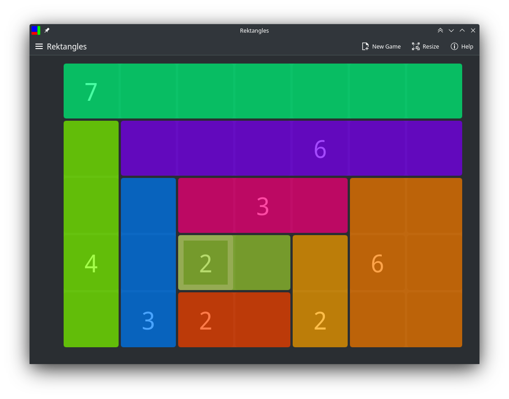
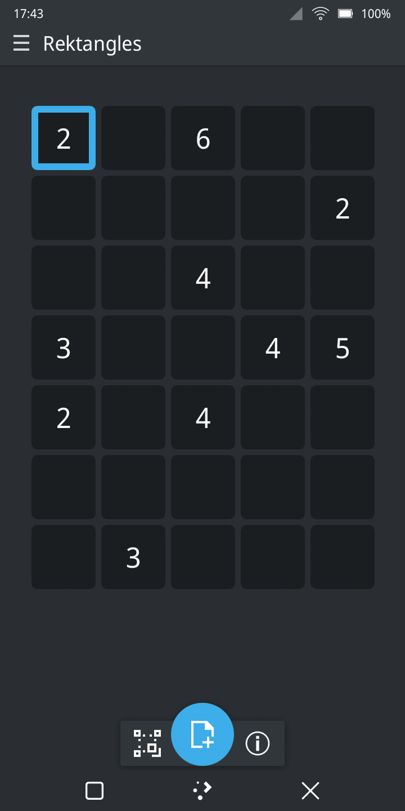
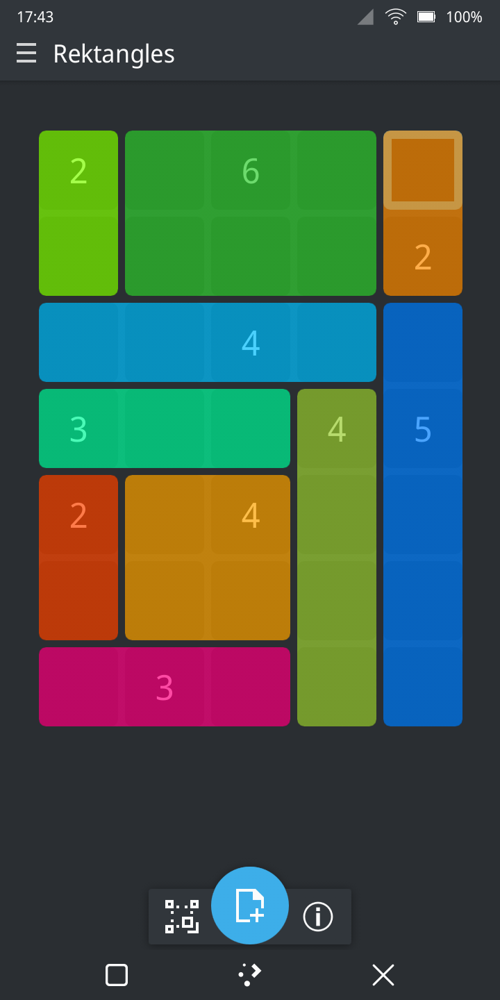

# Rektangles

Implementation of a Japanese puzzle game known as shikaku. A game for PinePhone (and for desktop).

## How to play

### Rules
1. Divide the grid into rectangles.
2. Each rectangle should contain exactly one number.
3. The number must be equal to the territory of the rectangle.

### Controls
- Navigation: arrow keys
- Enter/exit selection mode: Space/Enter
- New game: N
- Resize board: R
- Quit: Q

## Screenshots

